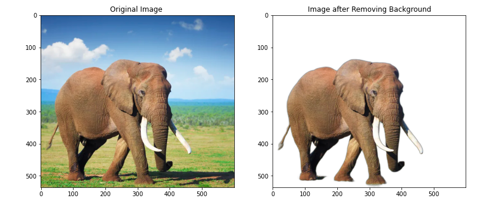
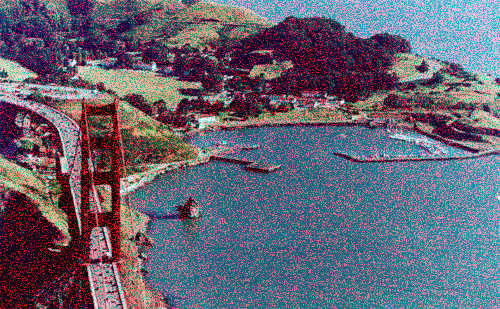
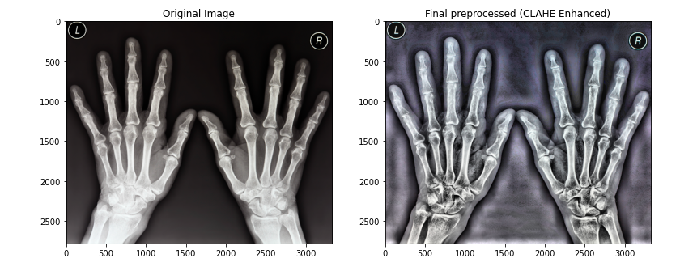

# Image-Prepossessing


**Table of Contents**

1. [Install Necessary Libraries Python](#Install-Necessary-Libraries-Python)
2. [Remove Background from Image](#Remove-Background-from-Image)
3. [Remove Noise from Image](#Remove-Noise-from-Image)
4. [Improving Image Quality](#Improving-Image-Quality)


## Install Necessary Libraries Python

Python dependencies installation:

```bash
(venv) $ pip install -r requirements.txt
```


## Remove Background from Image


## Remove Noise from Image


## Improving Image Quality

